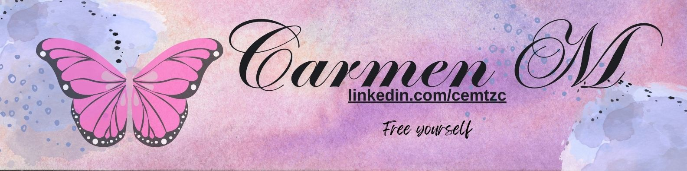
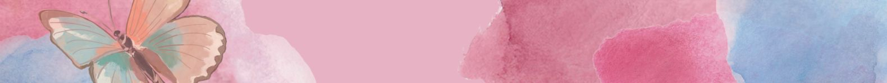
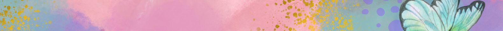
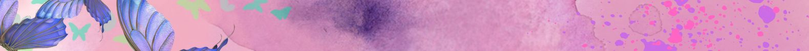

# Welcome everyone!

## Hi! You are welcome to make yourself at home. It's a pleasure to receive you. Feel free to explore my projects; all feedback and observations are well-received. I hope you enjoy them, and if you have any suggestions or comments, I will receive them with open arms. Thank you for your visit!

### I am currently learning new ways to diversify myself
👉 👉 

### 🌎Find me around the web

👉  ________ 👉 ___________ 👉 ___________ 👉 ___________ 👉&nbsp;

### 💪 Proyects 
👉[Interfaz de Pinterest](https://github.com/cemtzc/interfazdepinterest)
This project is a clone of the Pinterest UI, created purely with HTML and CSS3.
It focuses on replicating the visual appearance of Pinterest, offering a similar browsing experience with a responsible design and basic functionalities.

<!--
**cemtzc/cemtzc** is a ✨ _special_ ✨ repository because its `README.md` (this file) appears on your GitHub profile.

Here are some ideas to get you started:

- 🔭 I’m currently working on ...
- 🌱 I’m currently learning ...
- 👯 I’m looking to collaborate on ...
- 🤔 I’m looking for help with ...
- 💬 Ask me about ...
- 📫 How to reach me: ...
- 😄 Pronouns: ...
- ⚡ Fun fact: ...
-->
